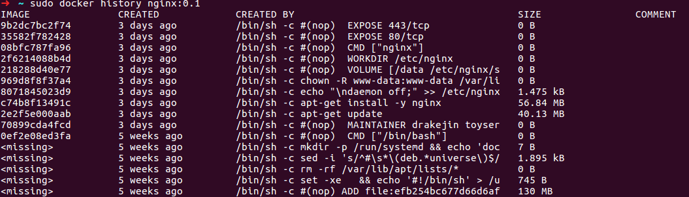
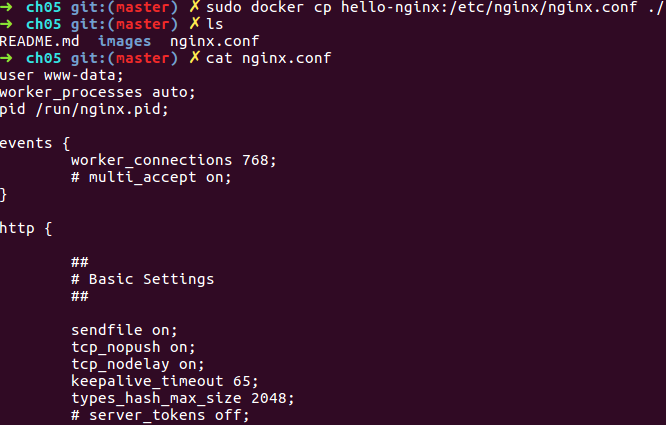
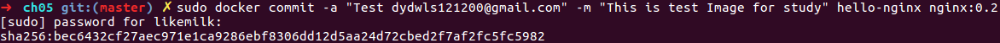
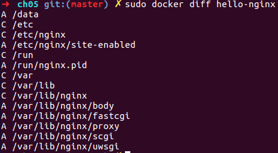
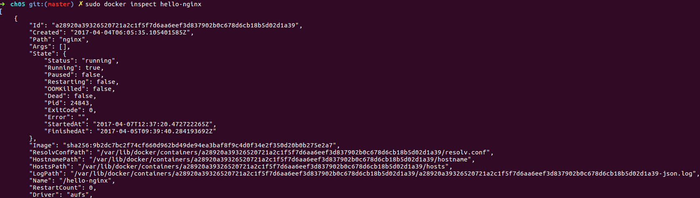

# docker history
이미지 히스토리를 살펴보도록 하자.

``` bash
$ sudo docker history {image_name}:{tag}
# or
$ sudo docker history {image_id}
```
아이디 값{image_id} 또는 {image_name}:{tag}을 이용하여 설치한 이미지의 내역을 확인할 수 있다.

#### 실행 화면



# docker cp
컨테이너 내부의 파일을 꺼내와보자.

#### 실행 화면




``` bash 
$ sudo docker cp {container_name}:{container_internal_file} {store_path}
```

# docker commit
컨테이너의 변경사항을 이미지로 저장

``` bash
$ sudo docker commit -{option} "{title}" -m "{content}" {container_name} {image_name}:{tag}
```

#### 실행 화면



# docker diff
commit 이후 컨테이너에서 변경된 파일 확인하기

 - A는 추가된 파일
 - C는 변경된 파일
 - D는 삭제된 파일

``` bash
$ sudo docker diff {container_name}
```

#### 실행화면




# docker inspect
컨테이너 세부정보 확인

``` bash
$ sudo docker inspect {container_name}
```

#### 실행화면




