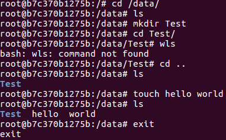
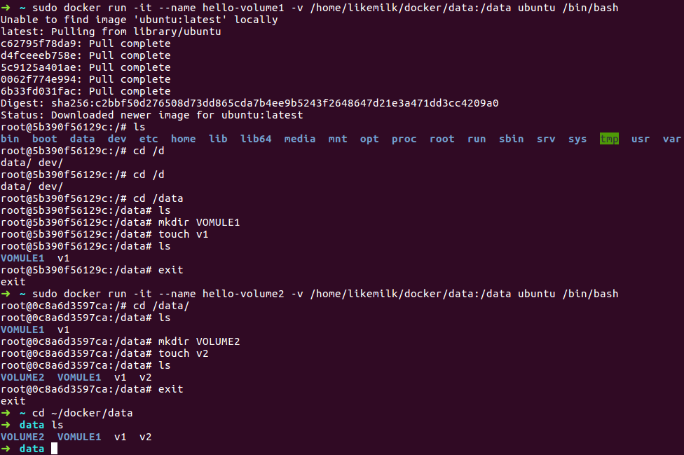
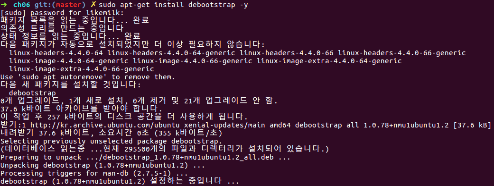
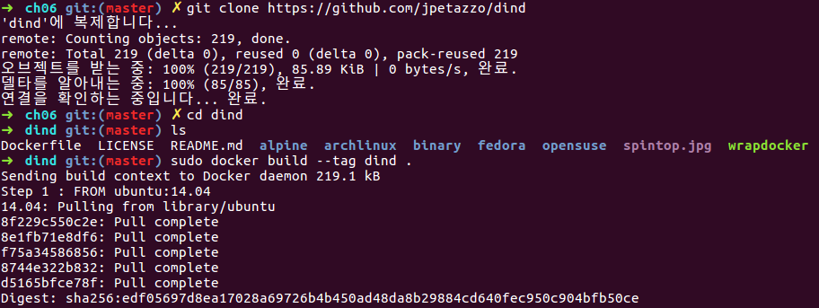

# Docker 데이터 볼륨 
 - Docker의 데이터 볼륨은 데이터를 컨테이너가 아닌 호스트에 저장하는 방식
 - 데이터 볼륨은 컨테이너끼리 데이터를 공유할 때 활용할 수 있다.
 - Docker 컨테이너 안의 파일 변경사항은 Union File System에 의해 관리된다.
 - 데이터 볼륨은 Union File System을 통하지 않고 바로 호스트에 저장된다.
 - Union File System은 docker container 
 - 데이터 볼륨 은 공유를 위한 호스트 File System!
 - _즉 docker commit 명령을 통해 이미지로 생성해도 데이터 볼륨의 변경 사항은 이미지에 포함되지 않는다._ 

# 컨테이너 안에 data volume 만들기

``` bash
$ sudo docker run -i -t --name {container_name} -v {data_volume_path} {image_name} /bin/bash

#container / > cd /data
#container /data > touce hello world
#container /data > mkdir test
#container /data > ls -ailF

```
 - -v {data_volume_path} => 데이터 볼륨 디렉토리를 설정하는 옵션

#### 실행화면




# Host 에서 만들어진 data volume 으로 열람하기
sudo 권한이 아니고서는 만들어진 data_volume으로 탐색이 불가능하다.
실행화면에 접근하는 디렉토리에 파일을 생성하면 컨테이너에서도 생성될것이다.

 - 1.9버전 미만

  ``` bash 
$ sudo docker inspect -f "{{ .Volumes }}" hello-volume
  ```
 - 1.9버전 이상

  ``` bash
$ sudo docker insect -f "{{ .Mount }}" hello-volume 
  ```
#### 실행화면(1.9 이상의 실습화면)


# 두 컨테이너와 호스트의 디렉토리를 공유하자
  1. 컨테이너를 생성하고 데이터 볼륨을 설정한다. 그리고 생성된 컨테이너의 /data 디렉토리에 파일을 생성하고 빠져나온다

``` bash
$ sudoc docker run -it --name {container_name} -v {host_dir_path}:{container_dir_path} {image_name} /bin/bash
```

#### 실행화면 




# 볼륨 컨테이너 사용하기
 데이터 볼륨 컨테이너는 데이터 볼륨을 설정한 컨테이너를 뜻함.
일반 컨테이너에서 데이터 볼륨 컨테이너를 연결하면 데이터 볼륨 컨테이너 안의 데이터 볼륨을 디렉터리에 접근할 수 있다.
 


 ``` bash
# 호스트와 공유할 디렉토리를 하나 지정한다.
$ sudo docker run -it --name hello-volume -v /home/likemilk/docker/data/:/data ubuntu /bin/bash
# 컨테이너의 /data 디렉토리에 파일을 만들고 빠져나올때
# 해동 컨테이너를 종료하면 안된다. 
# ctrl + p => ctrl +q 로 빠져나올 수 있도록 하자.
$ sudo docker run -it --volumes-from hello-volume --name using-volume ubuntu /bin/bash
# --volumes-from {container_name}은 데이터 볼륨 컨테이너를 연결할 때 사용한다.

 ```
#### 실행화면


# Docker Base Images 생성하기
보통 Dockerfile로 이미지를 생성할 때 Docker Hub에서 제공하는 공식이미지를 기반으로 생성합니다. 공식이미지가 아닌 자신만의 이미지를 만들어봅시다. 


 ``` bash
$ sudo apt-get install -y debootstrap
# 부트스트랩 도구 debootstrap 을 설치한다.

$ sudo debootstrap trusty trusty
# debootstrap 으로 우분투 trusty 바이너리 파일을 받는다. trusy는 코드네임이다. 
# sudo debootstrap {code_name} {dir_path}
# 우분투 버전별 코드네임 https://wiki.ubuntu.com/DevelopmentCodeNames

$ sudo tar -C trusty -c . | sudo docker import - trusty
# $ sudo docker import http://example.com/trusty.tgz trusty
# sudo docker import {URL} {image name}:{tag}
# 또는 웹상에서 만들어진 우분투 바이너리 파일을 사용할 수 있습니다.


$ sudo docker images 
# 설치가 잘 되었나 확인합니다. 

# 임포트 한 trusty 이미지로 컨테이너를 생성합니다.
$ sudo docker run -it --name debootstrap trusty /bin/bash

 ```

#### 실행화면 




# Docker in Docker

우분투 14.04 에서는 정상 동작 합니다만 CentOS 6.5 또는 7.0에서 잘 안됩니다. 커널 패닉 및 마운트 실패.. 등등.. Docker 는 1.1.2이상을 추천합니다.


``` bash 
$ git clone https://github.com/jpetazzo/dind
# git hub에서 Dockerfile과bash 스크립트를 다운받아야 합니다.

$ cd dind
$ sudo docker build --tag dind .
# 이미지를 생성합니다.

$ sudo docker run -it --privileged dind
# dind 프로젝트에서 생성한 이미지로 컨테이너를 생성합니다.
# --privileged 옵션은 컨테이너 안에있는 호스트의 리눅스 커널 기능을 모두 사용할 수 있도록 합니다.
# Docker in Docker 는 실험적 기능이라 로그가 기본으로 출력되도록 설정되어 있습니다. 
# $ sudo docker run -it --privileged -e LOG=file dind
# 로그 설정을 파일로하려면 다음과 같이 하시면 됩니다. 

# ------------- 지금은 도커안의 도커가 설치된 컨테이너에 있습니다
$ sudo docker run -it busybox:latest /bin/sh

```

#### 실행화면 




> 컨테이너 구성은 다음과 같이 되어있습니다.
> 호스트 -> dind 컨테이너 -> busy box 컨테이너 


