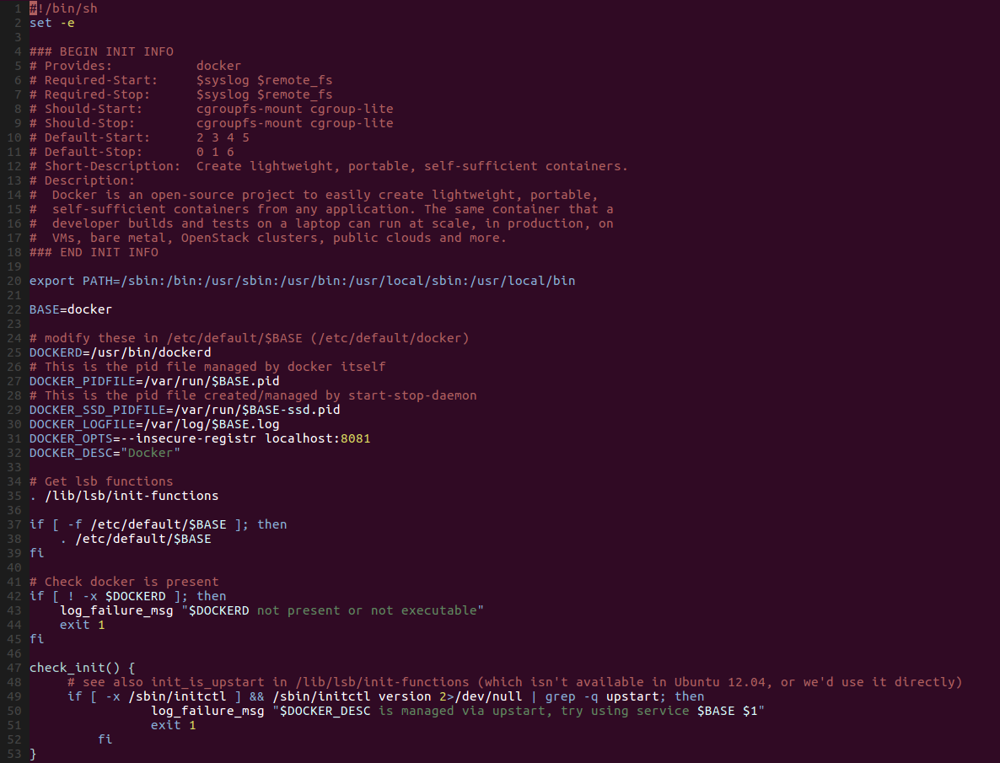
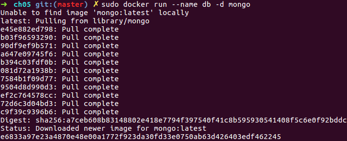
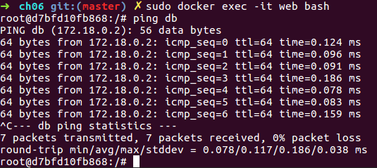

# 개인저장소 구축

 - Docker 저장소 서버는 Docker 레지스트리(registry) 서버로 부름.
 - git의 push와 pull의 기능과 같다. Repository로 소스를 올리고 내려받는 역할이다.

# Docker Registry 동작
Docker Registry 서버에서 이미지를 저장하는 방법
 1. Docker Registry 서버에 저장하기
 2. Amazon S3에 저장하기  

# Private Docker Registry Server
 1. 먼저 실행되고 있는 Docker 데몬을 정지한 뒤 --insecure-registry 옵션을 사용하여 Docker Daemon을 실행신다.
   - _참고자료[https://forums.docker.com/t/running-an-insecure-registry-insecure-registry/8159]_
   - docker -d --insecure-registry localhost:xxxx 이 부분은 docker1.8.0이후로 제한됨
   - docker -d 가 docker daemon으로 바뀜 

 2. /etc/init.d/docker 를 수정한다.

``` bash
DOCKER_OPTS=--insecure-registry localhost:8081
```

#### 실행화면



# Container 연결(1.9.0 미만 가능)
 Docker로 이미지를 생성할 때 한 이미지에 웹 서버,DB등 필요한 프로그램을 설치하여 사용할 수 있지만
프로그램별로 이미지를 생성하는게 일반적입니다. 그러므로 프로그램이 설치된 컨테이너로 접속할 일이 빈번하게 발생합니다.

``` bash 
$ sudo docker run --name {container_name} -d {image_name}
```
% run 명령어에서는 설치된 mongo 이미지가 존재하지 않으면 설치하고 컨테이너를 생성합니다

#### 실행화면


Docker에서 컨테이너끼리 연결하기 위해서는 docker run 명령에서 --link 옵션을 사용해야합니다. 

``` bash 
$ sudo docker run --name {new_container_name} -d -p {local_port}:{container_port} --link {db_container}:{alias} {new_image}
```
% 마찬가지로 nginx 이미지가 없다면 새로 설치하고 컨테이너를 생성합니다 
 
#### 실행화면


# Container 연결이 잘 안되네?(1.9.0 이상 가능)
docker 1.12라서 그런지 위 명령어로는 아직 연결이 되지 않았다. 또한 --link는 곧 사라질 예정이기 때문에 다른 설정방법을 사용해야합니다.
docker 에서는 1.9.0버전부터 컨테이너들간에 네트워크를 생성할 수 있는 기능이 추가되었습니다. 이 때 네트워크를 생성하고 컨테이너를 연결시키면 해당 네트워크 안에 속한 컨테이너끼리는 서로 접속할 수 있습니다.

 - 참조링크 : https://docs.docker.com/engine/userguide/networking/default_network/dockerlinks/

1. docker network를 먼저 생성합니다.

 ``` bash 
$ sudo docker network create hello-network
 ```

2. db container 를 생성하면서 hello-network에 연결합니다.

 ``` bash 
$ sudo docker run --name db -d --network hello-network mongo 
 ```

3. web 컨테이너를 생성하면서 hello-network에 연결합니다

 ``` bash
$ sudo docker run --name web -d -p 8080:80 --network hello-network nginx
 ``` 

4. web 컨테이너에서 bash셸을 실행한 뒤에 ping을 실행해봅시다.

``` bash
$ sudo docker exec -it web bash
```

#### 실행화면




----------------


# 같은 Host가 아닌 다른 Host의 Docker 컨테이너에 연결하기
앞서 설명한 --link는 연결하는 옵션이지만 1.9버전 이상일때에는 안되니 network를 구성해서 써야 합니다.

# 임배서더 컨테이너(Ambassador Container)
 - 
 - 정의 : 서비스 소비자와 제공자 사이에서의 하드코딩으로 구현한 네트워크 연결들
 - 목적 : 도커는 이식성(portability)제공을 위해 임배서더 컨테이너를 제공합니다.
 - 설명 : 앰배서더 컨테이너는 특별한 컨테이너가 아닌 그냥 일반적인 Docker 컨테이너입니다. 앰배서더 컨테이너는 socat이라는 프로그램을 이용하여 TCP 연결을 다른 곳으로 전달하도록 구성되어 있습니다.

#### 참고 이미지


docker run 명령을 실행할 때 전달한 환경 변수를 이용하여 socat을 실행하는 셸 스크립트 입니다.
``` bash 
# ./ch06/Dockerfile

CMD env | grep _TCP= | \
    sed 's/.*_PORT_\([0-9]*\)_TCP=tcp:\/\/\(.*\):\(.*\)/socat \
    TCP4-LISTEN:\1,fork,reuseaddr TCP4:\2:\3 \&/'  \
    | sh && top
```

docker run 명령에서 --link 옵션을 주거나 -e AMB_PORT_8082_TCP=tcp://{접속할 서버의 IP및 domain}:{접속할 서버의 포트} 를 넣어서 접속할 임베서더 호스트의 주소를 입력합니다.


# 원격 서버에서의 작업

``` bash
  # docker 다운로드 
$ sudo apt install -y docker.io

  # redis 이미지 다운로드 
$ sudo docker pull redis:latest

  # 원격서버에서 사용할 redis 컨테이너 생성
$ sudo docker run -d --name redis redis:latest

  # ambassador network생성
$ sudo docker run -d --link redis:redis --name redis_ambassador -p {container_port}:{host_port} svendowideit/ambassador 
```
 - -d => 옵션으로 컨테이너를 백그라운드로 실행시킵니다.
 - --link redis:redis => 옵션으로 redis컨테이너를 redis란 이름
 - --name redis_ambassador => 옵션으로 컨테이너 이름을 redis_ambassador로 지정합니다.
 - -p {container_port}:{host_port} => 서버의 도커 컨테이너 포트와 서버 호스트 포트를 연결시킵니다.
 - svendowideit의 ambassador 이미지를 받아서 컨테이너로 생성합니다. 
 - svendowideit은 docker 의 ambassador pattern으로 저명한 사람이다. open source 에 기여한 갓님...

# 로컬 서버에서의 작업

1. 연결하기

 ``` bash
$ sudo docker run -d --name redis_ambassador --expose {server_redis_port} -e AMB_PORT_{PORT}_TCP=tcp://211.239.***.***:{port} svendowideit/ambassador
 ```
 - -d => 옵션으로 컨테이너 백그라운드로 실행합니다.
 - --name redis_ambassador => 옵션으로 컨테이너 이름을 redis_ambassador로 지정합니다.
 - --expose {server_amb_port} => 즉 redis 클라이언트가 이 원격의 redis_ambassador 컨테이너의 포트에 접속하게 됩니다. -- 
 - --expose 옵션과 -p => --expose 옵션은 호스트의 포트를 외부에 노출하지 않습니다.  
 - svendowideit 의 ambassador 컨테이너를 다운받고 실행시킵니다.


2. 테스트 하기
 ``` bash
$ sudo docker run -i -t --rm --link redis_ambassador:redis relateiq/redis-cli
 ```
 - -i -t => 옵션으로 콘솔에서 입출력을 할 수 있도록 설정합니다.
 - --rm => 컨테이너를 실행만하고 컨테이너를 만들지 않습니다. 이미지만 남아있는 1회성 컨테이너입니다.
 - --link redis_ambassador => 옵션으로 redis_ambassador 컨테이너를 redis 별칭으로 연결합니다.


redis-cli 에 들어가 원격서버로 연결지 잘 되었는지 redis의 ping테스트를 합니다.
 ``` bash 
redis 211.239.***.***:{port} > ping 
PONG
 ```


